# dcpvaml 🚗🔩
dcpvaml : Automotive &amp; Insurance # Vertex AutoML Vision # Damaged Car Parts

##  Objective
- Upload labeled dataset to Cloud Storage using CSV file & connect it to Vertex AI as a Managed Dataset.
- Inspect uploaded images to ensure there are no errors in your dataset.
- Kick off an AutoML Vision model training job.
    - use Manual(advanced) data split
- Request predictions from a hosted model trained on the same dataset.

## Vertex AutoML Vision : Identify Damaged Car Parts

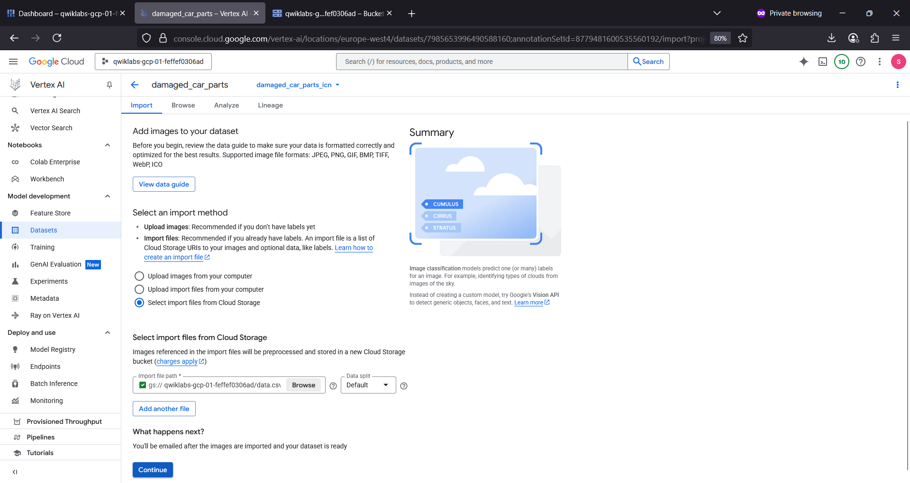

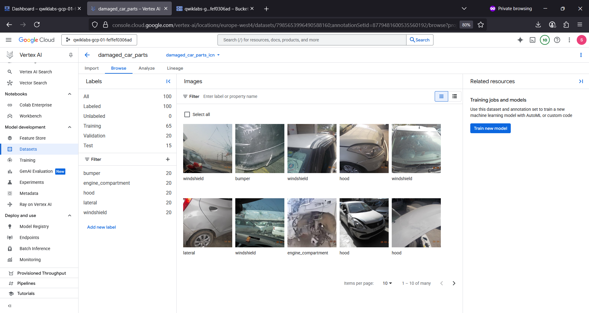

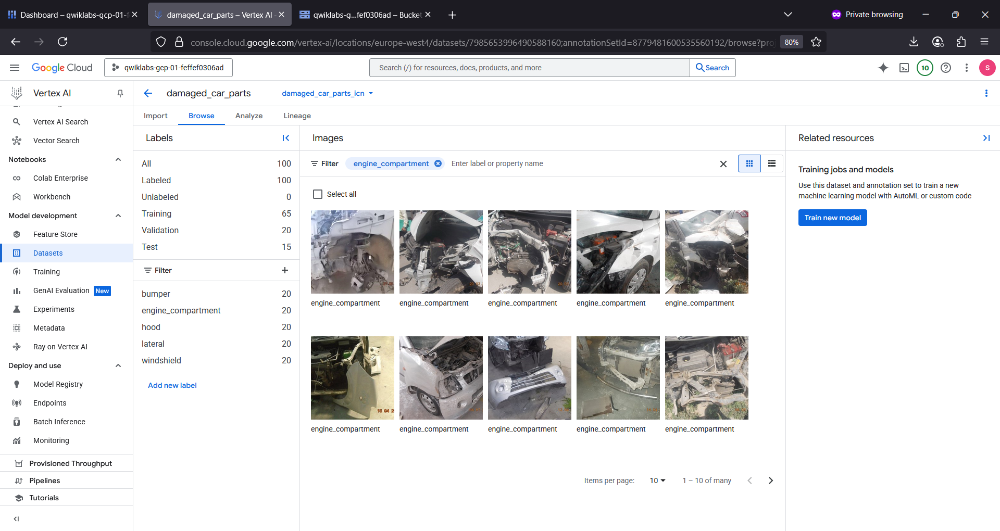

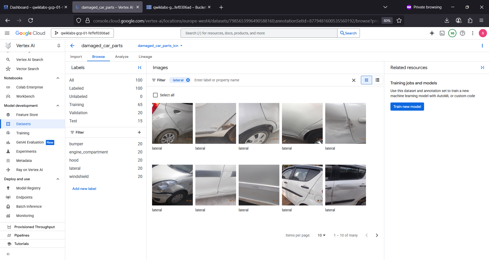

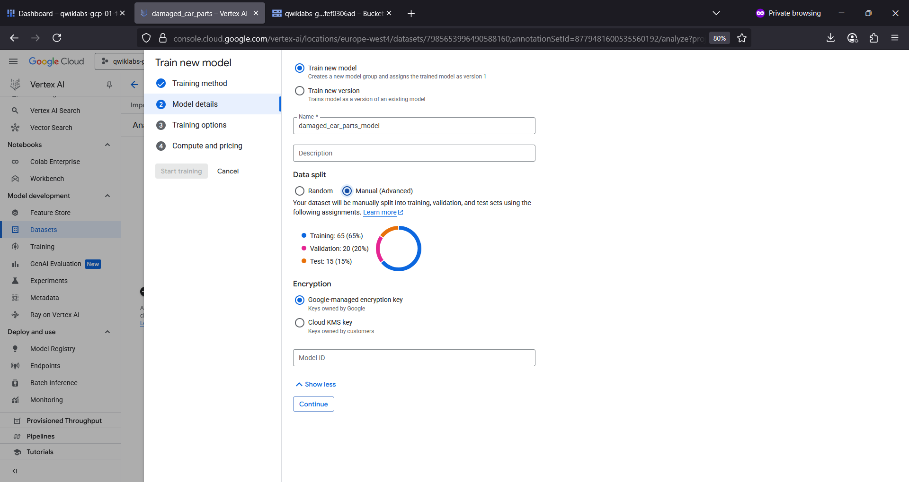

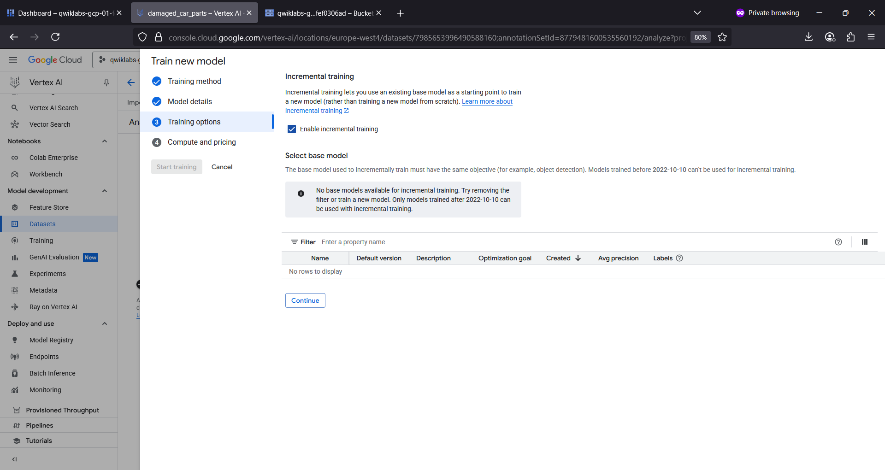

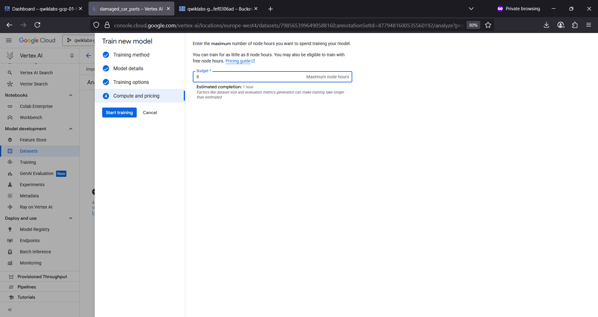

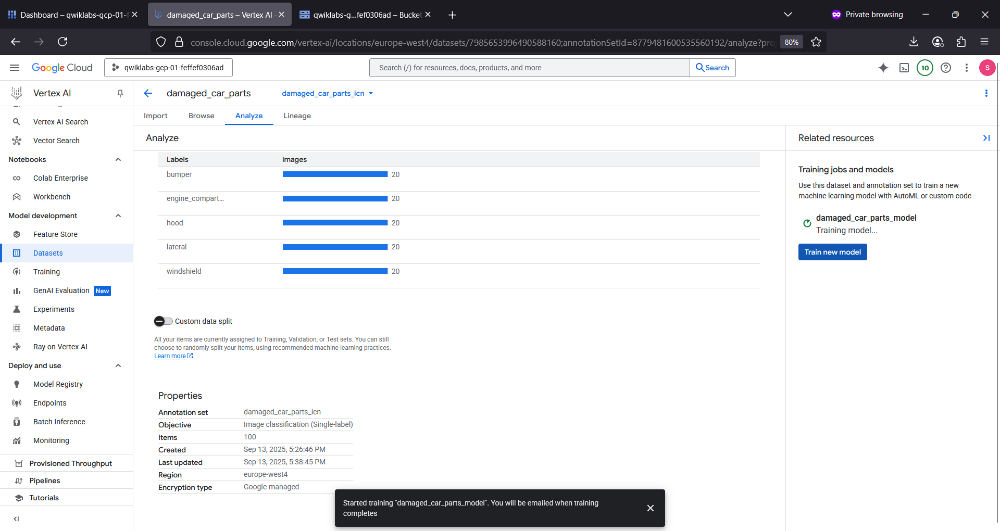

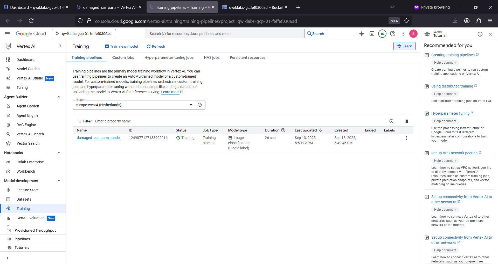

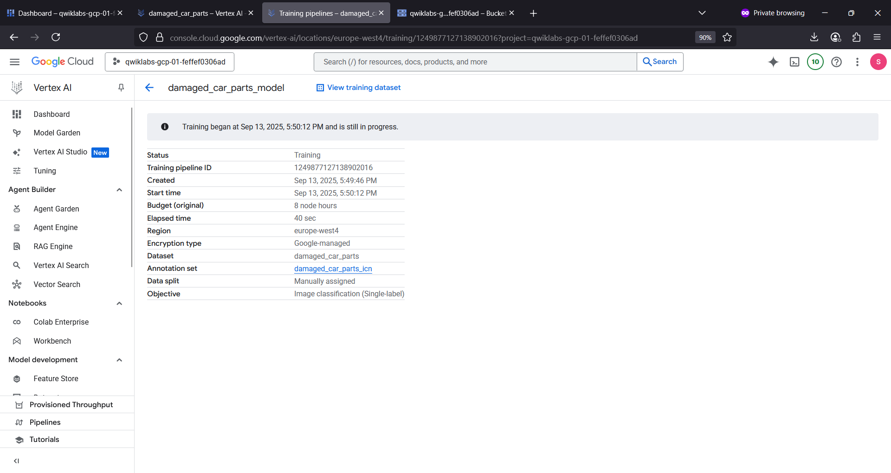

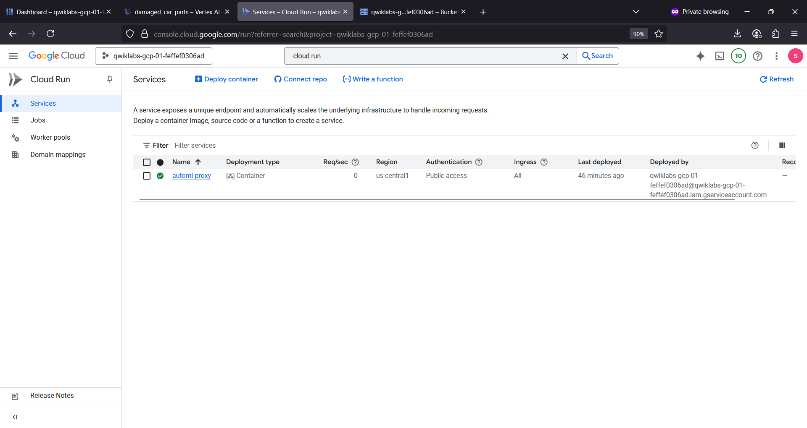

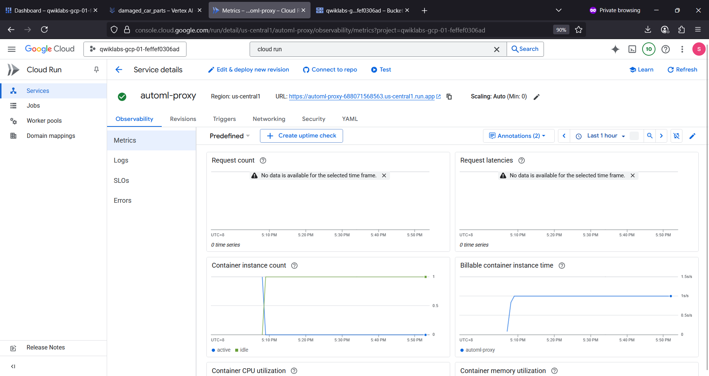

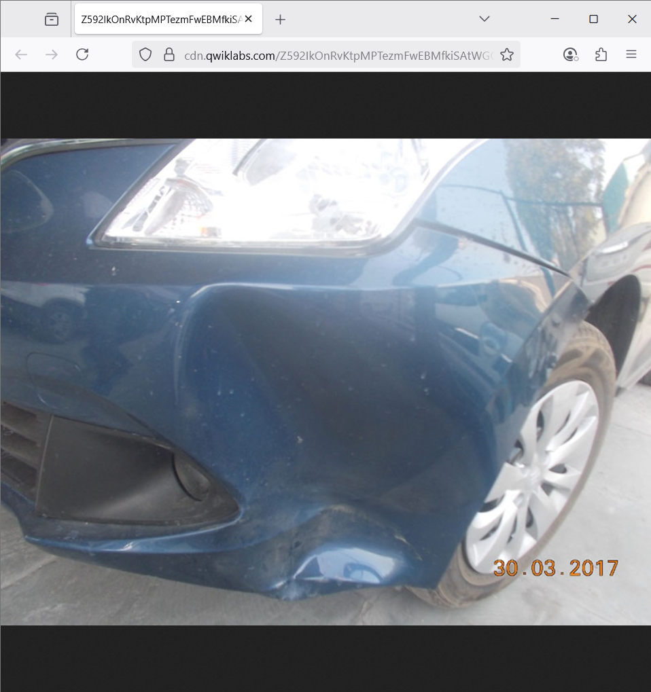

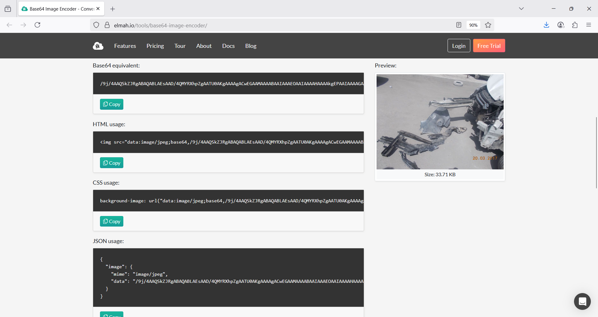

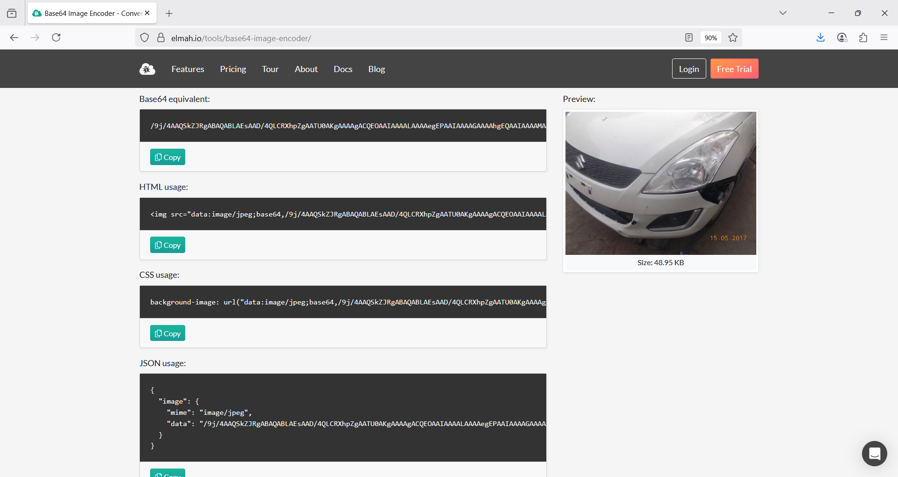

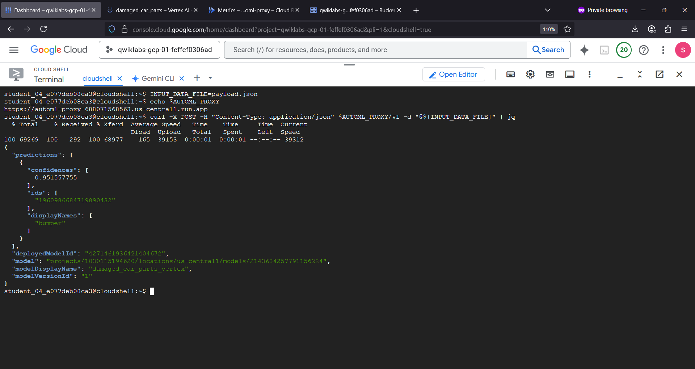

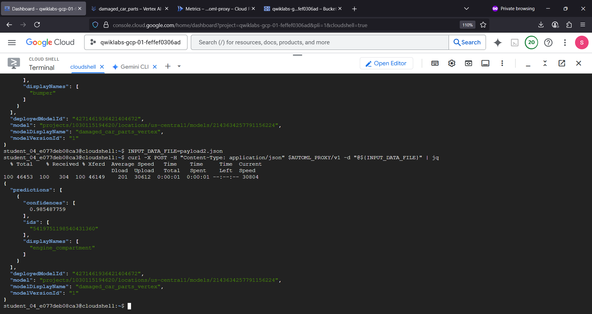

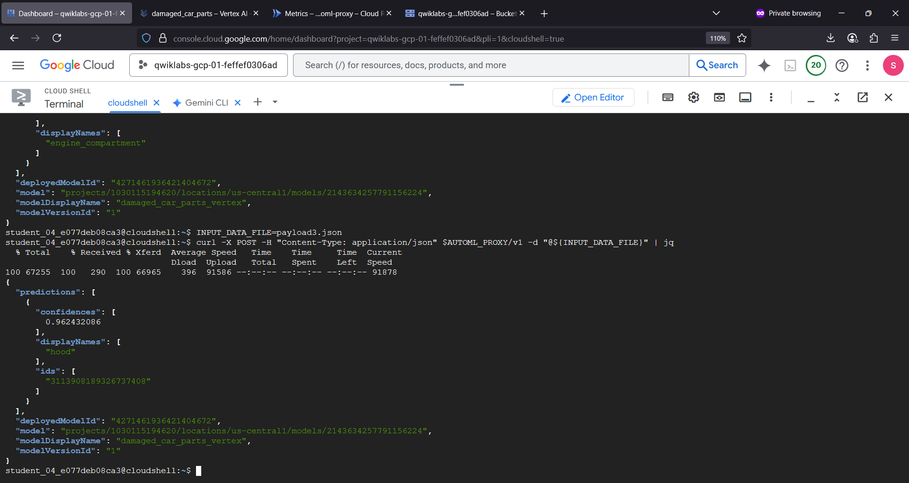

